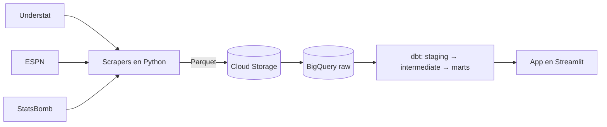

[English](README.md) | Español

# Football win analytics

Un pipeline de datos y un análisis que buscan responder qué hace falta para ganar un partido de fútbol, con diez temporadas de las cinco grandes ligas europeas.

## Contexto

Proyecto de curso, IE University, Big Data Technologies (primavera de 2026). Hecho en pareja.

## Funcionalidades

- Extrae resultados, xG y estadísticas de jugadores de Understat, y alineaciones de ESPN, para LaLiga, Premier League, Bundesliga, Serie A y Ligue 1.
- Un scraper aparte para los datos de eventos de StatsBomb Open Data, en las temporadas que StatsBomb cubre.
- Guarda los archivos en bruto como Parquet en Google Cloud Storage y los carga en BigQuery.
- Modelos de dbt en cuatro capas: raw, staging, intermediate y marts. Los marts son tablas en esquema de estrella para clasificación, enfrentamientos directos, rendimiento de jugadores, táctica, comparación de equipos y perfiles de victoria.
- Normaliza los nombres de los equipos entre los tres esquemas de origen para que los partidos crucen bien.
- Los tests de dbt (xG nunca negativo, dos equipos por partido) se ejecutan en cada pull request con GitHub Actions.
- Una app en Streamlit con una presentación de los hallazgos y un dashboard interactivo que consulta BigQuery. Una comprobación previa (dry run) bloquea cualquier consulta de más de 10 GB.

## Cómo funciona



`main.py` procesa una liga y una temporada cada vez: descarga partidos y jugadores de Understat, los sube a Cloud Storage, descarga las alineaciones de ESPN, las sube y carga las tres tablas en BigQuery. Las subidas se saltan los archivos que ya existen, así que repetir una ejecución cuesta poco. Después, dbt construye los modelos sobre las tablas raw. Un workflow manual de GitHub Actions puede lanzar el pipeline completo, incluida una carga histórica.

## Resultados

Más de 18.000 partidos y más de 500.000 filas de estadísticas de jugadores.

- El volumen de xG explica el 72 % de la variación en el porcentaje de victorias (R² 0,72). La tasa de conversión explica el 25 % (R² 0,25).
- Los equipos que ganan promedian 1,86 xG por partido. Los que pierden, 0,98.
- Entre 2014 y 2023, el xG medio generado por equipo subió un 17,5 % y la intensidad de presión (10 / PPDA) bajó un 34,8 %. El porcentaje de victorias no cambió.
- Antes de la normalización, los nombres de los equipos de la Bundesliga coincidían entre fuentes en torno al 39 % de las veces.

## Cómo ejecutarlo

Necesitas un proyecto de Google Cloud con BigQuery y Cloud Storage, y una clave de cuenta de servicio.

```bash
git clone https://github.com/lucasavila23/football-win-analytics.git
cd football-win-analytics
python -m venv venv && source venv/bin/activate
pip install -r requirements.txt
cp .env.example .env   # y rellena los valores
```

Cambia `GCP_PROJECT_ID` y `GCS_BUCKET_NAME` en `pipeline/config.py` por tu proyecto y tu bucket.

```bash
# Cargar una temporada de una liga
python main.py --seasons 2023 --leagues la_liga

# Construir y testear los modelos de dbt
cd dbt
DBT_PROFILES_DIR=. dbt run --vars '{"target_season": "2023"}'
DBT_PROFILES_DIR=. dbt test --vars '{"target_season": "2023"}'
cd ..

# Arrancar la app
streamlit run streamlit_app/app.py
```

`python main.py --backfill` carga de 2014 a 2023 para las cinco ligas.

## Tecnologías

Python (pandas, soccerdata, statsbombpy), Google Cloud Storage, BigQuery, dbt Core, GitHub Actions, Streamlit, Plotly.

## Estructura del proyecto

```
pipeline/        scrapers y loaders (GCS, BigQuery)
dbt/             modelos staging, intermediate y marts, tests, macros
streamlit_app/   presentación y dashboard
tests/           scripts de validación de scrapers, loaders y joins
main.py          punto de entrada del pipeline
```

## Autor

Lucas Avila Manotas · [LinkedIn](https://www.linkedin.com/in/lucas-avila23)
