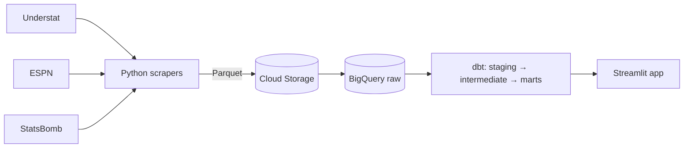

English | [Español](README.es.md)

# Football win analytics

A data pipeline and analysis that asks what it takes to win a football match, using ten seasons of data from Europe's five biggest leagues.

## Context

Course project, IE University, Big Data Technologies (spring 2026). Built with a teammate.

## Features

- Scrapes match results, xG and player stats from Understat, and lineups from ESPN, for La Liga, Premier League, Bundesliga, Serie A and Ligue 1.
- A separate StatsBomb Open Data scraper for event data, for the seasons StatsBomb covers.
- Stores raw files as Parquet in Google Cloud Storage and loads them into BigQuery.
- dbt models in four layers: raw, staging, intermediate and marts. The marts are star-schema tables for standings, head-to-head, player performance, tactics, team comparison and winning profiles.
- Normalises team names across the three source schemas so matches join correctly.
- dbt tests (no negative xG, two teams per match) run on every pull request through GitHub Actions.
- A Streamlit app with a presentation of the findings and an interactive dashboard that queries BigQuery. Queries over 10 GB are blocked by a dry-run check.

## How it works



`main.py` runs one league and season at a time: fetch Understat matches and players, upload to Cloud Storage, fetch ESPN lineups, upload, then load all three tables into BigQuery. Uploads skip files that already exist, so reruns are cheap. dbt then builds the models on top of the raw tables. A manual GitHub Actions workflow can run the whole pipeline, including a full backfill.

## Results

Over 18,000 matches and more than 500,000 player-stat rows.

- xG volume explains 72% of the variation in win rate (R² 0.72). Conversion rate explains 25% (R² 0.25).
- Winning teams average 1.86 xG per match. Losing teams average 0.98.
- From 2014 to 2023, average xG created per team rose 17.5% while pressing intensity (10 / PPDA) fell 34.8%. Win rates stayed flat.
- Before normalisation, Bundesliga team names matched across sources about 39% of the time.

## Run it

You need a Google Cloud project with BigQuery and Cloud Storage, and a service-account key.

```bash
git clone https://github.com/lucasavila23/football-win-analytics.git
cd football-win-analytics
python -m venv venv && source venv/bin/activate
pip install -r requirements.txt
cp .env.example .env   # then fill in the values
```

Set `GCP_PROJECT_ID` and `GCS_BUCKET_NAME` in `pipeline/config.py` to your own project and bucket.

```bash
# Ingest one season for one league
python main.py --seasons 2023 --leagues la_liga

# Build and test the dbt models
cd dbt
DBT_PROFILES_DIR=. dbt run --vars '{"target_season": "2023"}'
DBT_PROFILES_DIR=. dbt test --vars '{"target_season": "2023"}'
cd ..

# Start the app
streamlit run streamlit_app/app.py
```

`python main.py --backfill` loads 2014 to 2023 for all five leagues.

## Stack

Python (pandas, soccerdata, statsbombpy), Google Cloud Storage, BigQuery, dbt Core, GitHub Actions, Streamlit, Plotly.

## Project structure

```
pipeline/        scrapers and loaders (GCS, BigQuery)
dbt/             staging, intermediate and mart models, tests, macros
streamlit_app/   presentation and dashboard
tests/           scraper, loader and join validation scripts
main.py          pipeline entry point
```

## Author

Lucas Avila Manotas · [LinkedIn](https://www.linkedin.com/in/lucas-avila23)
